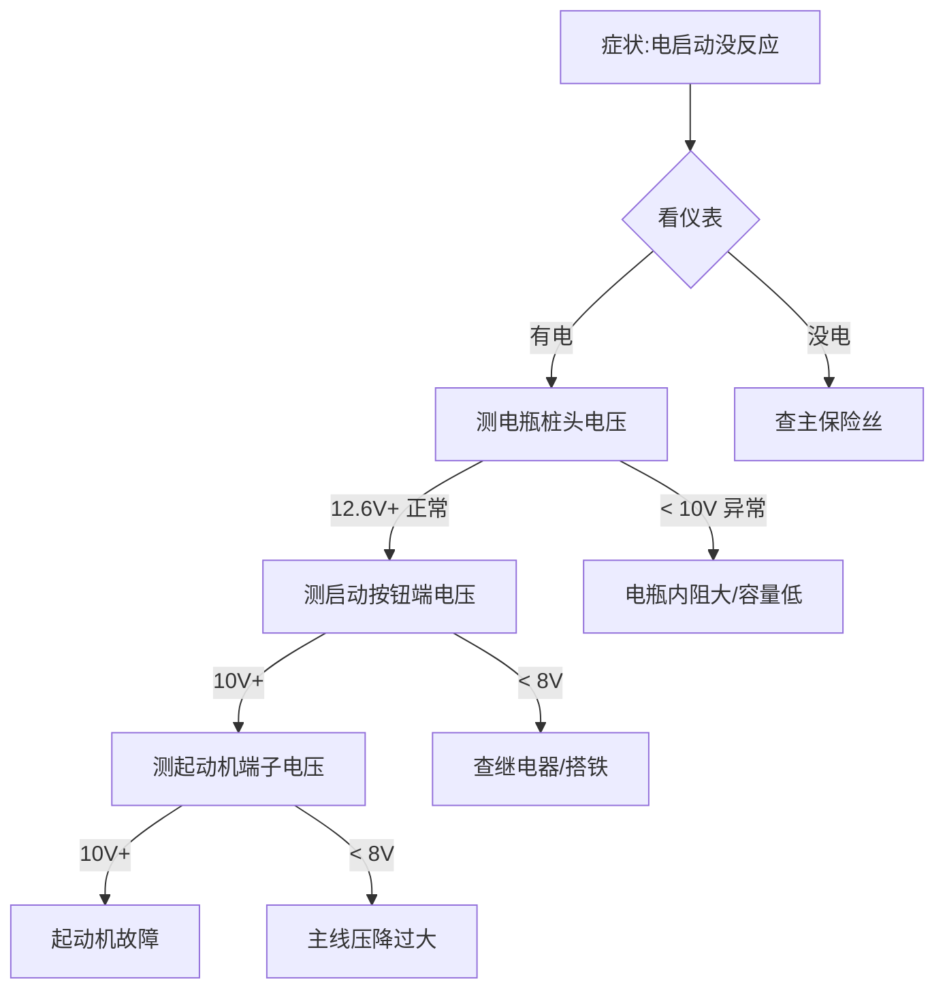

你的任务:在《摩托车维修全手册》第 13 章 13.8 节"电气系统故障诊断"加**万用表测点图**(Mermaid 流程图形式)。

## 上下文

CH13 第一遍审校(6.3/10)报告"建议修改"列第 1 条:
> 给 13.8 增加"万用表黑表笔接哪里、红表笔量哪里"的测点图

13.8 节现有 5 个案例:
- 13.8.1 案例 1:电启动没反应 ★★★(已加引用 CH13.1-13.X.4)
- 13.8.2 案例 2:充电指示灯亮 ★★
- 13.8.3 案例 3:大灯不亮 ★★
- 13.8.4 案例 4:转向灯频率不对
- 13.8.5 案例 5:电瓶桩头腐蚀

**本任务**:为这 5 个案例**各加一个 Mermaid 流程图**——展示"症状 → 测点 → 判断"三步走。

## 必读

1. ./vol03/CH13-电气系统.md(找 13.8 段,1358 行附近)
2. ./PRINCIPLES.md

## 现有 13.8 节内容(参考)

13.8.1 的现有"诊断流程"是文本形式(代码块):
```
1. 看仪表(有没有显示)
2. 听声音
3. ...
```

你要做的是:**在每个案例的现有诊断流程之后,加一个 Mermaid 流程图作为"补充测点图"**。

## Mermaid 模板(用这个)



## 设计原则

1. **每个图 5-10 个节点**——少看不清楚,多看晕
2. **节点用诊断动作**(测/查/量),不是症状
3. **每条边带判断条件**——电压值、电阻值、声音等可测量的判据
4. **终点指向"故障原因"或"下一步检查"**
5. **用中文节点**(读者是中文用户)
6. **不画复杂图**——单层 graph 够用,不要 subgraph 嵌套

## 5 个图的具体内容(每个 200-400 字 + 流程图)

### 13.8.1:电启动没反应(参考上面的模板)
- 测点:电瓶桩头电压、启动按钮端、起动机端子、搭铁电阻

### 13.8.2:充电指示灯亮
- 测点:发电机输出(熄火测电瓶,启动后测 13.5-14.5V)、整流桥二极管正反向、调压器输出

### 13.8.3:大灯不亮
- 测点:大灯开关前后、大灯继电器触点、灯泡电阻(冷/热)、搭铁

### 13.8.4:转向灯频率不对
- 测点:闪光器输入输出、灯泡功率(同侧两灯是否一致)、搭铁

### 13.8.5:电瓶桩头腐蚀
- 测点:桩头电压降(负载时)、桩头-卡箍电阻、充电电压

## 工作流程

1. 读 CH13 找 13.8.1 - 13.8.5 各小节
2. 在每个小节**现有诊断流程代码块之后**,加一个 `### 13.8.X 测点图` 子节
3. 子节内放 Mermaid 流程图 + 简短说明(50-100 字)
4. 用 patch 工具,**每个 13.8.X 加 1 个 patch**——5 个 patch,每个 patch 单独
5. **不**执行 git commit
6. 输出报告

## 输出格式

```
=== 13.8 测点图扩展报告 ===

| 案例 | 状态 | 节点数 | 备注 |
|------|------|--------|------|
| 13.8.1 | OK/FAIL | N | ... |
| 13.8.2 | OK/FAIL | N | ... |
| 13.8.3 | OK/FAIL | N | ... |
| 13.8.4 | OK/FAIL | N | ... |
| 13.8.5 | OK/FAIL | N | ... |

总节点数:合计
残留问题:列出
```

## 约束

- **只**在 13.8.1-13.8.5 加 Mermaid,不碰 13.8 节其他内容
- **不**改现有诊断流程(那是文本版,跟流程图互补)
- Mermaid 语法必须能直接渲染——`graph TD` / `{}` 菱形 / `[]` 矩形 / `-->|text|` 边
- 中文节点用 `[]` 包:`A[症状:电启动没反应]`
- **不**用 `subgraph`(复杂嵌套)
- 节点数 ≤ 12(超过 12 容易看不清)

开始工作。
