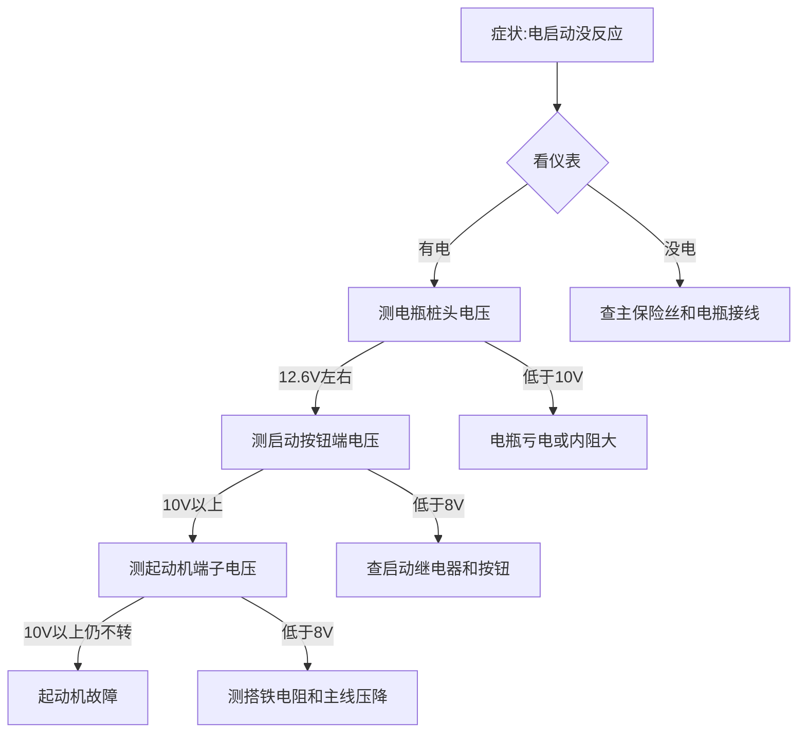
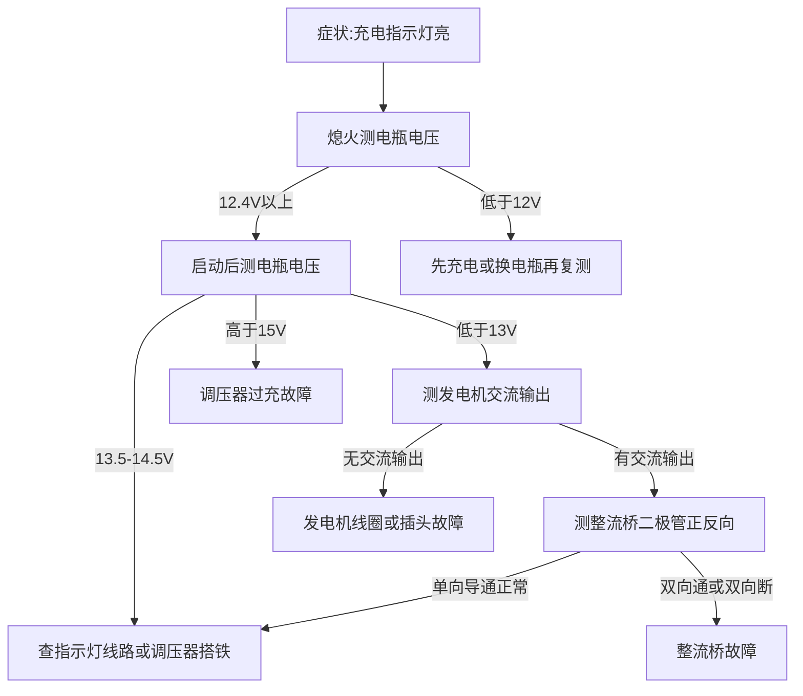
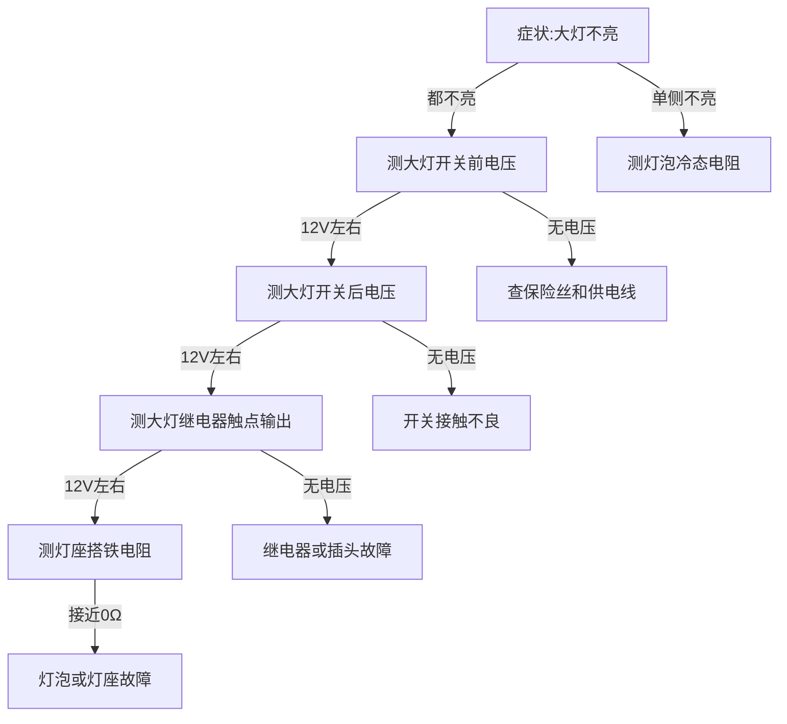
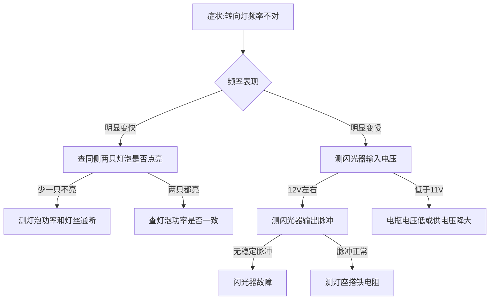
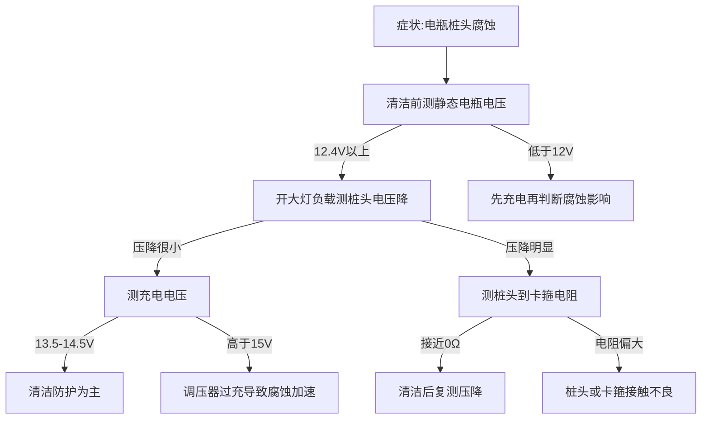

# 第13章 电气系统

> **新手自查指引**：你是修理摩托车的新手吗？
> - **电瓶没电、大灯不亮、启动没反应**？看 13.0.3 速查表
> - 想搞懂电瓶/发电机/点火系统？看 13.1-13.3
> - 想自己换电瓶?看 13.9.2(**车主能做的保养之一**)
> - 保险丝烧了？看 13.5（**必学**）
> - 大灯/转向灯不亮？看 13.6
> - 想学老师傅的实战经验？看 13.10
>
> **一句话定位本章**：电气系统是摩托车的"神经系统"。**这章车主能做的很多**（换电瓶、换保险丝、换灯泡），但**发电机/电喷 ECU 问题基本送修**。

---

## 13.0 阅读说明

### 13.0.1 本章结构

- **原理层**（13.1-13.4）：电瓶、发电机、起动系统、点火系统的原理
- **维修技能层**（13.5-13.7）：换保险丝、换灯泡、喇叭仪表等
- **故障诊断与实战层**（13.8-13.9）：常见电气故障 + 实战
- **经验沉淀层**（13.10）：新手必踩的坑 + 老师傅不外传的诀窍

### 13.0.2 符号说明

- 【问答】 新手问答 | 【注意】 常见误解 | 【严重警告】 严重警告
- 【维修】 维修场景 | 【数据】 数据举例 | 【口诀】 记忆口诀
- 【步骤】 操作步骤 | 【费用】 省钱贴士 | 【送修】 该送修了
- 【经验】 老师傅经验（本章独有的沉淀块）
- 【来源】 **数据来源等级**：⭐⭐⭐（通用原理）/ ⭐⭐（权威第三方通用规范）/ ⭐（AI 训练数据，**未实时验证**）

### 13.0.3 速查表（30 秒定位你的电气问题）

**症状 → 最可能的 3 个原因 → 怎么办**：

| 症状 | 最可能的 3 个原因 | 怎么办 |
|------|----------------|--------|
| 电启动没反应 | 电瓶没电/保险丝断/启动机坏 | **先检查电瓶** |
| 启动机"哒哒哒"不转 | 电瓶电量不足/接线松 | 检查电瓶电压+紧固接线 |
| 启动机转但发动机不转 | 启动机单向离合器坏 | 送修 |
| 整车没电 | 电瓶没电/主保险丝断/接线断开 | 检查电瓶+主保险丝 |
| 大灯不亮 | 灯泡烧/保险丝断/开关坏/线路断 | 检查灯泡+保险丝 |
| 大灯亮度低 | 电瓶电量不足/发电机输出低/接线电阻大 | 测电瓶电压+发电机输出 |
| 转向灯不亮 | 灯泡烧/闪光器坏/开关坏 | 检查灯泡 |
| 转向灯频率不对 | 闪光器坏/灯泡瓦数不对 | 换闪光器 |
| 喇叭不响 | 喇叭坏/开关坏/保险丝断 | 检查喇叭+保险丝 |
| 仪表不显示 | 电瓶没电/线路问题/传感器坏 | 检查电瓶 |
| 充电指示灯亮 | 发电机不发电/调压器坏 | 测发电机输出 |
| 启动后电瓶一直不充电 | 发电机坏/调压器坏/线路断 | 测发电机输出 |
| 电瓶液位低 | 长期未加水/过充电 | 加蒸馏水或换电瓶 |
| 电瓶桩头腐蚀 | 长期未清洁/漏酸 | 清洁+涂凡士林 |
| 启动后冒蓝烟 | 烧机油 | 见第 6 章 |

### 13.0.4 学完本章你将能

- 看懂电瓶、发电机、点火系统的工作原理
- 自己检查电瓶（**骑前必查**）
- 自己换电瓶（**车主能做的保养之一**）
- 自己换保险丝（**必学**）
- 自己换灯泡
- 诊断常见电气故障
- **判断哪些活自己能干，哪些必须送修**

---

### 13.1.1 电气系统原理层：系统功能与设计目标

摩托车电气系统不是「电瓶+几根线」那么简单——它包含**电源（电瓶+发电机+整流器）、起动系统（起动机+继电器）、点火系统（高压包+火花塞）、信号系统（灯光+喇叭+仪表）、ECU**等子系统的复杂网络（来源：⭐⭐⭐）。

【机制】 **设计目标 1：在所有工况下稳定供电。** 摩托车电气系统面临**极端工况变化**：
- 启动瞬间：起动机要 100-200 A,3-5 秒短时 大电流，电瓶电压瞬间跌到 9-10V
- 怠速：发电机低转速，发电功率不够用，电瓶要辅助供电
- 高速：发电机高转速，发电功率过剩，要稳压器把电压锁在 14V 左右
- 熄火：纯电瓶供电，电瓶要撑住警报灯、ECU 记忆等几毫安到几百毫安的小负载

**电气系统的任务是在所有这些工况下保持电压稳定（13.5-14.5V 范围）**——电压太低 ECU 复位、点火能量不足；电压太高烧灯泡、烧 ECU（来源：⭐⭐⭐）。

【机制】 **设计目标 2：把化学能、机械能、磁能三种能量形式相互转换。**
- **电瓶**：化学能 ↔ 电能（放电/充电）
- **发电机**：机械能 → 电能（法拉第电磁感应）
- **起动机**：电能 → 机械能（通电导体在磁场中受力）
- **点火线圈**：电能 → 磁能 → 电能（自感/互感升压）
- **火花塞**：电能 → 热能+光能（击穿空气放电）

**这些转换都有损耗**——电瓶放电效率 70-85%、发电机效率 60-80%、起动机效率 60-80%、点火线圈效率 80-90%。**起动机链路总效率约 60-80%**(不是 30-50%)——这是为什么电气系统设计要在「功率够用」和「损耗最小」间取平衡(来源：⭐⭐)。点火是**高电压、低能量**事件：电压上万伏，但单次火花总能量只有几十毫焦级(详见 13.1.9 / 13.4.1 / 13.X.11)。

【机制】 **设计目标 3：耐受振动、防水、宽温度。** 摩托车电气系统比汽车恶劣得多：
- **振动大**：发动机振动+路面颠簸——接头必须防水抗震
- **温度范围宽**：-20°C 到 +80°C——电瓶容量、发电机效率、ECU 工作都受影响
- **防水**：雨水、洗车、涉水——所有接头都要 IP67 级
- **电磁干扰**：点火高压放电、电感负载开断——**必须有滤波和屏蔽**

【问答】 **为什么摩托车电气系统普遍 12V？**
12V 是汽车行业历史选择（早期 6V 容量不够，升到 12V）。**12V 系统的好处**：
- 启动机功率足够（小车 0.5-2 kW）
- 火花塞击穿电压可达到（约 10-40 kV，常见 15-40 kV；具体随线圈、火花塞间隙、缸压和系统类型变化）
- 灯泡功率合适（35-65W 头灯足够亮）
- 安全（12V 人体触电一般无危险）

**现代趋势**：部分车型开始用 48V 轻混系统（汽车），但**摩托车 12V 仍主流**——成本低、技术成熟、零件通用（来源：⭐）。

【经验】 **老师傅一句话**：电气系统不是「电瓶+线」那么简单——它要管能量转换、稳压、抗振、防水、抗干扰五件事；任何一处掉链子，整车趴窝。

---

### 13.1.2 核心物理原理一：欧姆定律与基尔霍夫定律

【机制】 摩托车电路的基础是**欧姆定律 + 基尔霍夫定律**（来源：⭐⭐⭐）：

**欧姆定律**：
V = I × R

V 是电压（V），I 是电流（A），R 是电阻（Ω）。

**功率公式**：
P = V × I = I² × R = V² / R

P 是功率（W）。

**基尔霍夫电流定律（KCL）**：**节点处电流代数和为零**——流入节点的电流 = 流出节点的电流。

**基尔霍夫电压定律（KVL）**：**任意闭合回路中,沿绕行方向所有电压升的代数和等于所有电压降的代数和**(代数和为零)。单电源简化电路可表述为"回路电压降之和等于电源电压",但多电源或含电动势的回路必须用代数和为零的形式。

**实操意义**：
- 任何电路问题都可以列方程求解
- **电压降**：长电线的电阻不可忽略——**大电流长线会显著压降**（如启动机到电瓶的粗线如果过长，线损能吃掉 1-2V）
- **并联 vs 串联**：并联负载电流相加，电压相同；串联负载电流相同，电压按电阻分配

**反直觉点**：**12V 电瓶的 12V 是「标称」**——实际电压随负载和充电状态变化。满电 12.6-12.8V，放电中 11.5-12V，过放 < 11V，启动时瞬间跌到 9-10V。**「12V」是设计目标，不是常数**（来源：⭐⭐⭐）。

**详见** [CH13.1-电工学基础.md 13.X.1](CH13.1-电工学基础.md) —— 欧姆/KCL/KVL 实战:7.6A 总电流 + 0.1Ω 氧化接头 → 0.76V 压降 + 5.8W 发热,接头发黑导致灯暗

【经验】 **老师傅一句话**：电气故障先查「电压」再看「电阻」——电压是症状，电阻是原因，欧姆定律是桥。

### 13.1.3 核心物理原理二：铅酸电瓶的电化学反应

【机制】 铅酸电瓶（lead-acid battery）正极是**二氧化铅（PbO₂）**，负极是**海绵状铅（Pb）**，电解液是**稀硫酸（H₂SO₄ 水溶液）**（来源：⭐⭐⭐）。

**放电反应**（化学能 → 电能）：

负极：Pb + SO₄²⁻ → PbSO₄ + 2e⁻
正极：PbO₂ + 4H⁺ + SO₄²⁻ + 2e⁻ → PbSO₄ + 2H₂O
总反应：Pb + PbO₂ + 2H₂SO₄ → 2PbSO₄ + 2H₂O

**充电反应**（电能 → 化学能）：**放电反应的逆过程**

**关键观察**：
- 放电时**硫酸被消耗** → **电解液密度下降**（比重从 1.28 降到 1.10）
- 充电时**硫酸被生成** → **电解液密度上升**
- **通过测量电解液密度可以判断电瓶电量**（比重计法）

**极化**（polarization）：放电时电极表面生成 PbSO₄ 钝化层，**真实电压低于电动势**（开路 2.1V vs 工作 1.8-2.0V）。**充电时也有极化**——所以充电电压要高于放电电压（13.8-14.4V 才能充进 12V 标称电瓶）。

反直觉点：**电瓶不是「电池」**——它是**两个化学反应的可逆容器**。**充电把放电反应逆回去**，化学物质回到正负极。**深度放电会生成大颗粒 PbSO₄**——充电时难以还原，**永久损失容量**（来源：⭐⭐）。

【经验】 **老师傅一句话**：铅酸电瓶怕「过放」——放空了硫酸变硫酸铅大晶体，充不回来就废了；浅充浅放、永远别放到 11V 以下。

### 13.1.4 核心物理原理三：电池容量、CCA 与寿命

【机制】 电池的两个关键参数（来源：⭐⭐⭐）：

**容量（Capacity）**：单位**Ah**（安时）。
- 例如 12V 10Ah 电池：理论上可以 1A 放电 10 小时，或 10A 放电 1 小时，或 100A 放电 0.1 小时
- **实际容量随放电电流变化**——大电流放电实际可用容量小于标称容量（Peukert 效应）
- **温度影响**：低温容量下降（电解液黏度↑，离子迁移率↓），0°C 比 25°C 容量少 20-30%

**CCA**（Cold Cranking Amps，冷启动电流）：
- 电池在 -18°C 下能持续 30 秒输出的最小电流，同时保持电压 ≥ 7.2V（12V 电池）
- 数字越大启动能力越强
- 摩托车 100-300 A 常见(小排量可低至 80 A)

**寿命**（cycle life）：
- 铅酸电池典型 200-500 次完整循环
- **放电深度越深，循环寿命越短**（深度循环 50% 一次 = 浅循环 100% 多次）
- **温度**：高温加速板栅腐蚀，寿命下降；低温下容量下降但寿命延长

反直觉点：**电瓶放完电放着不充电，会永久损坏**。**硫酸铅大晶体在电极上形成「硫酸盐化」**（sulfation），充电时难以还原。**这就是为什么长时间不骑的车要先充电**——放着 1 个月电瓶可能就废了。

【经验】 **老师傅一句话**：电瓶寿命取决于「用得多深 + 充得多满 + 温度多高」；浅放浅充、常温、满电存放是长寿三件套。

### 13.1.5 核心物理原理四：AGM/锂电池 vs 普通铅酸

【机制】 三种主流电瓶的对比（来源：⭐⭐⭐）：

| 类型 | 内部结构 | 优点 | 缺点 | 寿命 |
|------|---------|------|------|------|
| **普通铅酸**（flooded） | 液态电解液 | 便宜 | 漏液风险、要加水、怕振动 | 2-3 年 |
| **AGM**（Absorbed Glass Mat） | 玻璃纤维吸附电解液 | 免维护、防漏、抗振 | 比普通铅酸贵 30-50% | 3-5 年 |
| **锂电**（LiFePO4） | 锂离子化学 | 极轻（1/3 铅酸）、寿命长 | 贵 3-10 倍、低温性能差、需专用充电 | 5-8 年 |

**AGM 的核心优势**：
- 电解液吸附在玻璃纤维中——**不会流动、不会泄漏**
- 内部阻抗低——**大电流放电能力比普通铅酸好**
- 可以任意方向安装（普通铅酸必须正立）
- 抗震（无自由液面）

**锂电的工程挑战**：
- **充电管理**：锂电充电要严格控制电压（3.6V/单体），过充会起火
- **低温性能**：0°C 以下放电容量急剧下降
- **保护板（BMS）**：必须有电池管理系统防止过放、过充、短路
- **专用充电器**：不能直接用铅酸充电器（充电曲线不同）

反直觉点：**锂电轻是大优势**——摩托车减重 2-3 kg 电瓶等价于减更多簧上质量（电瓶一般位于车架中部），**对操控的改善明显**。但**成本是普通铅酸的 3-10 倍**——值不值看预算。

【经验】 **老师傅一句话**：选电瓶按「预算+车型+使用环境」——AGM 是大多数车主的甜点，锂电是预算足的进阶，普通铅酸是预算紧的底线。

### 13.1.6 核心物理原理五：发电机的电磁感应

【机制】 摩托车发电机（alternator）= **永磁转子 + 定子绕组**——**机械能 → 电能**（来源：⭐⭐⭐）。

**基本原理——法拉第电磁感应**：

ε = -dΦ/dt

其中 ε 是感应电动势（V），Φ 是磁通量（Wb），t 是时间（s）。**磁通变化率越大，感应电动势越大**。

**结构**：
- **转子**（rotor）：永久磁铁（早期）或励磁绕组（部分车型）；曲轴带动旋转
- **定子**（stator）：固定在发动机壳体上，绕有三相绕组（U/V/W）
- 转子旋转时，磁通穿过定子绕组变化，产生**三相交流电**

**两种主要结构**：
- **永磁式**（magnetic alternator）：转子是永久磁铁；结构简单、可靠；**输出电压随转速变化大**（需要稳压器）
- **励磁式**（excited alternator）：转子是电磁铁（需要励磁电流）；**输出电压可控**（通过调节励磁电流）

**摩托车主流**：永磁式（简单可靠）。

反直觉点：**发电机输出不是「12V」**——而是**随转速变化的三相交流电**。怠速 1000 rpm 输出可能只有 10V；高速 5000 rpm 输出可能 > 60V。**整流器+稳压器把交流变直流、把电压锁在 13.5-14.5V**——这是关键的下游电路。

**详见** [CH13.1-电工学基础.md 13.X.5](CH13.1-电工学基础.md) —— 三相相量 120° 相位差 + 六二极管桥,三相整流脉动小、低转速也稳

【经验】 **老师傅一句话**：发电机是「能量转换器」不是「稳压器」；它输出的是高压交流电，整流稳压是后续电路的事。

### 13.1.7 核心物理原理六：整流器与稳压器的工程取舍

【机制】 整流器（rectifier）+ 稳压器（regulator）是发电机的下游电路（来源：⭐⭐⭐）。

**整流器**：
- **半波整流**：只让正半周通过，效率低（只用一半能量）
- **全波整流**：让正负半周都通过，效率高（用全部能量）
- **桥式整流**：6 个二极管（4 个或 6 个），把三相交流变成直流
- 摩托车主流：**三相全波桥式整流**

**稳压器**：
- **稳压二极管（zener）型**：老车用，电压高了就「吃掉」多余电流变成热
- **SCR（可控硅）型**：现代主流，电压高了就**短路到地**让多余电流不进入电瓶
- **开关式 DC-DC**：高端车用，效率高、发热小

**电压目标**：
- **浮充电压**（float voltage）：13.5-13.8V（电瓶满电后维持）
- **循环充电电压**（cycle voltage）：14.0-14.4V（电瓶需要补充电时）
- **过充保护**：> 14.5V 必须降下来，否则电瓶失水、寿命缩短

反直觉点：**稳压器是「烧能量」的系统**——多余的电能变成热。**这就是为什么车在高温环境+长时间高速行驶，稳压器可能热到烫手**——这是正常散热，不是故障。

**详见** [CH13.1-电工学基础.md 13.X.5 / 13.X.6](CH13.1-电工学基础.md) —— 三相整流 + SCR 触发角:SCR 触发后把定子部分能量短路成热,不是简单直流短路

【经验】 **老师傅一句话**：整流稳压器是发电机的「规矩先生」——把乱七八糟的交流电变成规矩的直流 14V；规矩先生自己会很热，因为它把多余能量都烧掉了。

### 13.1.8 核心物理原理七：起动机的串激直流电机

【机制】 起动机（starter motor）是**直流串激电机**——**电能 → 机械能**（来源：⭐⭐⭐）。

**基本原理——安培力**：

F = B × I × L

F 是导体受力（N），B 是磁通密度（T），I 是电流（A），L 是导体长度（m）。**通电导体在磁场中受力**——转子转动。

**串激电机的特点**：
- **电枢（转子）绕组**和**励磁（定子）绕组**串联
- 启动时电流极大（100-200 A,3-5 秒短时）→ 磁场极强 → 起动力矩极大
- 转速上升时反电动势增加 → 电流下降 → 力矩下降
- **特性曲线**：**高转矩低转速**，**特别适合启动**

**结构**：
- 直流电机本体
- **减速齿轮组**：电机转速 10000+ rpm → 通过齿轮减速到曲轴拖转约 150-300 rpm
- **单向离合器**（one-way clutch）：发动机启动后，**曲轴转速超过电机转速时自动脱开**——防止电机被发动机倒拖损坏
- **啮合方式**：摩托车起动机不用汽车式电磁啮合，而是通过减速齿轮组常啮合传动、单向离合器把扭矩传给曲轴；松开启动按钮后离合器脱开，曲轴不反拖电机（详见 13.3.2）

反直觉点：**起动机不能长时间运转**——连续启动不超过 5-10 秒，**每次启动间隔 1-2 分钟**。**原因**：
- 大电流通过绕组会**严重发热**（I²R 损耗）
- 长时间大电流会**烧毁绕组**或**电瓶过放**
- 单向离合器不能长时间高负荷

【经验】 **老师傅一句话**：起动机是「短跑选手」不是「马拉松选手」——一次 5 秒、间隔 2 分钟、连启动不超过 3 次；超过就是虐待电瓶+起动机。

### 13.1.9 核心物理原理八：点火系统的能量释放

【机制】 点火系统把 12V 电瓶的低压电**变成约 10-40 kV 高压，常见 15-40 kV**；具体随线圈、火花塞间隙、缸压和系统类型变化，击穿火花塞间隙放电，引燃混合气（来源：⭐⭐⭐）。

**关键步骤**：
1. **储能**：电瓶 12V → 点火线圈初级绕组（电感储能 W = ½LI²）
2. **断电**：触发器（触点或 ECU 信号）切断初级电流
3. **感应升压**：初级电流突然断开 → 磁场快速消失 → 初级绕组产生自感电动势（数百伏）；同时**互感**让次级绕组感应出**高压电动势**（约 10-40 kV，常见 15-40 kV）
4. **击穿放电**：高压击穿火花塞间隙 → 火花放电 → 引燃混合气

**两种主要点火方式**：
- **电感放电点火（IDI）**：传统点火，**线圈储能 → 断电升压**。能量 30-80 mJ。
- **电容放电点火(CDI)**:常见于小排量、越野车、老车型。**储能路径**:触发线圈(磁电机)或 DC-DC 升压 → 储能电容 → 触发晶闸管(SCR) → 点火线圈初级 → 升压到次级 → 火花塞。**典型储能**:30-200 mJ(电容 1-2 μF 充到 200-400 V),**次级电压约 10-40 kV，常见 15-40 kV**。
- **电感式晶体管点火(TCI / IDI)**:常见于现代中大排量。**储能路径**:电瓶 12V → 点火线圈初级持续通电储能 → 触发晶体管(IGBT)断开初级 → 磁场崩溃在次级感应出高压 → 火花塞。**典型储能**:30-100 mJ(取决于初级电流和电感),**次级电压约 10-40 kV，常见 15-40 kV**。
- **ECU 控制点火**:现代电喷车几乎都用。**ECU 根据曲位/转速/进气压力/温度算最佳点火时刻**,触发可以是 CDI 形式(电容储能)或 IDI 形式(电感储能),**统称 ECU 控制点火**。能量数值与上述相同,但**时刻精度 ±1°曲轴转角**(无 ECU 时代 ±3-5°)。
- **电感+电容复合**：高端车用，能量足、电压足。

**击穿电压**（V_breakdown）影响因素：
- 火花塞间隙（与 A01/CH06 统一）：街车 0.6-0.8 mm、跑车 0.7-0.9 mm、ADV 0.8-1.0 mm、赛车 0.9-1.0 mm；以车主手册为准（来源：⭐/❓）
- 缸内压力：压缩冲程接近上止点时压力高，击穿电压高
- 混合气浓度：理论空燃比时击穿电压最低
- 电极温度：热电极降低击穿电压

**反直觉点**：**火花塞间隙越小越易点火**——但小间隙**点火能量弱、火花核小**，对稀混合气点火可靠性差。间隙不是越小越好，按车主手册和指定火花塞型号设定。

**详见** [CH13.1-电工学基础.md 13.X.7](CH13.1-电工学基础.md) —— RL 瞬态:继电器/点火线圈断电瞬间 U_L = -L·dI/dt,自感电动势可冲到电源电压 10-100 倍,续流二极管/TVS 的作用

【经验】 **老师傅一句话**：点火不是「有火就行」——是「在正确时刻给正确能量的火」；能量太高浪费、太低点不着。

### 13.1.10 核心物理原理九：保险丝的电流-时间特性

【机制】 保险丝（fuse）是**电路的「安全阀」**——过流时熔断保护下游电路（来源：⭐⭐⭐）。

**熔断机理**（I²t 特性）：
- 保险丝材料（锌或银）有**低熔点**（锌 420°C、银 960°C）
- 电流通过时发热：**Q = I²Rt**（焦耳热）
- 发热量 > 散热量 → 温度上升 → 达到熔点 → 熔断
- 熔断时间与 I²t 相关——**过流越大熔断越快**

**典型熔断时间**：
- 1.1× 额定电流：不熔
- 1.35× 额定电流：约 1 小时
- 2× 额定电流：几秒 - 几十秒
- 5× 额定电流：毫秒级

**保险丝类型**：
- **快熔（fast blow）**：普通电路
- **慢熔（slow blow）**：电机负载（启动电流大但启动后电流小）
- **自恢复保险丝（PPTC）**：过流时电阻急剧上升，**冷却后自动恢复**——用于临时过流保护

**反直觉点**：**保险丝规格不能随意加大**——比如原 10A 换成 20A 保险丝，**下游电路过流时不会熔断，可能烧毁电线、ECU**。**保险丝的「保护」是用熔断换安全**——选大了保护失效。

**详见** [CH13.1-电工学基础.md 13.X.10](CH13.1-电工学基础.md) —— 保险丝 I-t 特性:1.1× 4 小时 / 1.35× 1 小时 / 2× 几秒 / 5× 毫秒,反时限保护,不是"超 10A 立刻断"

【经验】 **老师傅一句话**：保险丝是「电路里的替死鬼」——它比下游设备便宜，烧它保贵件；**绝不能换大规格「让保险丝不容易烧」**，那等于把安全阀换大了。

### 13.1.11 核心物理原理十：线束、继电器、CAN 总线基础

【机制】 现代摩托车电气系统不只是「电瓶+线」——还有**线束设计、继电器、CAN 总线**等关键工程（来源：⭐⭐⭐）。

**线束（wire harness）**：
- 摩托车上的电线不是单根——而是**线束**（多根电线捆在一起，加保护套）
- 线径选择：按电流选择（每平方毫米铜线允许 5-10 A）
- **长线压降问题**：从电瓶到车尾的线如果太长（3-5 米），需要更粗的线
- **电磁干扰**：点火高压线要远离信号线（防止干扰 ECU）

**继电器（relay）**：
- 用小电流（来自按钮开关）控制大电流（去往电机/灯泡）
- 解决「开关触点过流烧毁」问题——按钮只控制继电器线圈（< 1A），继电器触点承载大电流
- 摩托车常见继电器位置：启动继电器、灯光继电器、燃油泵继电器

**CAN 总线**（Controller Area Network）：
- 摩托车多个 ECU 之间的**数字通信协议**
- 双绞线（CAN_H、CAN_L），差分信号抗干扰
- 常见应用：仪表 ECU ↔ 发动机 ECU ↔ ABS ECU ↔ 车身 ECU
- **优点**：减少线束（多 ECU 共用 2 根线）、实时通信、诊断方便（OBD 接口读所有 ECU 数据）

**反直觉点**：**继电器故障比开关故障更常见**——继电器触点频繁开关会**烧蚀**（电弧烧），导致接触不良。**启动继电器坏**表现为「按启动按钮没反应」但**电瓶有电**——很多新手误以为是电瓶没电，其实是继电器坏了。

**详见** [CH13.1-电工学基础.md 13.X.2 / 13.X.3](CH13.1-电工学基础.md) —— 线束压降:R = ρL/A,55W 大灯 4.6A × 3m 线,压降超 3-5% 要查;接地:车架兼作地线,启动大电流不混传感器参考地

【经验】 **老师傅一句话**：电气系统问题 80% 是「接触不良」——保险丝松、继电器触点烧、线束接头氧化；用万用表先量电压判断哪一段不通。

### 13.1.12 主要组件与工作机制：从电瓶到火花塞

【机制】 **电瓶**：12V 直流电源。化学能 ↔ 电能；AGM 主流；容量 4-30 Ah（来源：⭐⭐⭐）。

【机制】 **发电机**：永磁转子+定子绕组。曲轴带动；输出三相交流电（来源：⭐⭐⭐）。

【机制】 **整流稳压器**：把交流变直流、把电压锁在 13.5-14.5V。SCR 主流（来源：⭐⭐⭐）。

【机制】 **起动机**：串激直流电机；启动电流 100-200 A,3-5 秒短时；单向离合器防倒拖（来源：⭐⭐⭐）。

【机制】 **点火线圈**：升压变压器；12V → 约 10-40 kV，常见 15-40 kV（来源：⭐⭐⭐）。

【机制】 **ECU**：控制喷油、点火、怠速、诊断；现代摩托车大脑（来源：⭐⭐⭐）。

【机制】 **保险丝盒**：电路保护；选错规格 = 保护失效（来源：⭐⭐⭐）。

【机制】 **线束**：连接所有电气部件；按电流选线径（来源：⭐⭐⭐）。

【经验】 **老师傅一句话**：电气系统的「电力流」是「电瓶→线束→用电设备→回电瓶」；每段都可能出故障——查电气问题先画这个流向图。

### 13.1.13 类型对比与工程取舍

| 部件 | 类型 | 优点 | 缺点 | 适用 |
|------|------|------|------|------|
| 电瓶 | 普通铅酸 | 便宜 | 维护麻烦、寿命短 | 老车、低端车（来源：⭐） |
| 电瓶 | AGM | 免维护、抗振、防漏 | 比铅酸贵 | 现代车主流（来源：⭐） |
| 电瓶 | 锂电池 | 极轻、寿命长 | 贵、低温差、需专用充电 | 高端车、改装（来源：⭐） |
| 点火 | 触点式 | 结构简单、便宜 | 触点烧蚀、点火能量低 | 老车（来源：⭐） |
| 点火 | CDI | 高压、火花强 | 电子元件故障难修 | 小排量、越野（来源：⭐） |
| 点火 | ECU 控制点火(CDI 或 IDI 形式) | 精确、能量足 | 复杂、贵 | 现代中大排量（来源：⭐） |
| 发电机 | 永磁式 | 简单可靠 | 输出电压随转速变 | 主流（来源：⭐） |
| 发电机 | 励磁式 | 输出电压可控 | 需要励磁电路 | 部分车型（来源：⭐） |

【机制】 **为什么 CDI 常见于小排量？** CDI 电路简单（电容+晶闸管+触发线圈）、成本低、对点火精度要求不高的低转速发动机够用。**但 CDI 火花持续时间短（微秒级），储能并不小；转速适应性取决于具体设计**。**现代中大排量几乎都用 ECU 控制点火(CDI 或 IDI 形式)**——更精确、能量足、可随工况调。

【机制】 **为什么摩托车上 CAN 总线越来越多？** 早期摩托车电气是「点对点」——每个传感器一根线到 ECU。**当 ECU 数量增加（ABS、TC、仪表、IMU 等）**，线束变得**多且重**。**CAN 总线让多 ECU 共用 2 根线通信**——线束简化、重量下降、实时性好。**代价**：CAN 协议故障需要诊断仪读码，普通车主难自己修。

【问答】 **新手电气故障，先查什么？**
1. **电瓶电压**：万用表量静态电压，< 12V 说明电瓶馈电或没充电
2. **启动后电压**：应该 13.5-14.5V，< 13V 发电机/整流坏，> 15V 调压器坏
3. **保险丝**：先看主保险丝再查分路保险丝
4. **接地线**：电瓶负极到车架的接地线**最容易被腐蚀**——很多故障是「接地不良」

【经验】 **老师傅一句话**：电气故障 80% 是「简单问题」：电瓶没电、保险丝烧、接地线松、继电器坏；**先查这几个再查 ECU**。

【机制小结】

- 电气系统是「能量转换+稳压+保护」的复合系统；要同时管发电、储电、稳压、用电、保护五件事（来源：⭐⭐⭐）。
- 欧姆定律 V=IR + 基尔霍夫定律是电路分析基础；电压降问题在长线大电流时不可忽略（来源：⭐⭐⭐）。
- 铅酸电瓶靠 Pb-PbO₂-H₂SO₄ 可逆反应；放电深度越深循环寿命越短；过放会永久硫酸盐化（来源：⭐⭐⭐）。
- 容量 Ah 标称，实际随放电电流和温度变化；CCA 是 -18°C 启动能力（来源：⭐⭐⭐）。
- AGM 防漏抗振；锂电轻但贵、低温差；选电瓶按预算+环境（来源：⭐⭐⭐）。
- 发电机是「机械能→三相交流电」的转换器；不是 12V 稳压器（来源：⭐⭐⭐）。
- 整流稳压器把高压交流变 13.5-14.5V 直流；多余能量变热（来源：⭐⭐⭐）。
- 起动机是串激直流电机；高转矩低转速适合启动；不能长时间运转（来源：⭐⭐⭐）。
- 点火系统把 12V 变成约 10-40 kV、常见 15-40 kV 击穿火花塞；CDI 高压、火花强；ECU 控制点火(CDI 或 IDI 形式) 能量足（来源：⭐⭐⭐）。
- 保险丝按 I²t 熔断；选错规格 = 保护失效（来源：⭐⭐⭐）。
- 继电器用小电流控大电流；继电器故障比开关故障更常见（来源：⭐⭐⭐）。
- CAN 总线让多 ECU 共用 2 根线通信；线束简化、实时性好、需诊断仪（来源：⭐⭐⭐）。
- 电气故障 80% 是「简单问题」：电瓶、保险丝、接地、继电器——先查这些再查 ECU（来源：⭐⭐⭐）。

---
## 13.2 发电机（充电系统）

### 13.2.1 发电机干什么的 ●●

**发动机运转时给电瓶充电 + 给整车电气供电**。

### 13.2.2 发电机类型

**1. 磁电机（Magneto / Alternator）**（**主流**）：
- 永久磁铁转子 + 定子线圈
- 不需要外部励磁
- 结构简单、可靠

**2. 三相交流发电机**：
- 三相绕组
- 输出后整流成直流

【来源】 **数据来源等级**：⭐（**你的车是哪种发电机，看说明书**）。

### 13.2.3 调压器（整流器）

**作用**：把发电机输出的交流电整流成直流电，并调节电压（13.5-14.5V）。

**没有调压器** = **电瓶过充** = **电瓶鼓包报废**。

### 13.2.4 充电系统故障 ●●●

**充电指示灯亮 = 充电系统故障**。

**可能原因**：
1. 发电机不发电（线圈断、磁铁弱）
2. 调压器坏
3. 线路断
4. 接线松

**诊断**：
```
1. 启动发动机
2. 测电瓶电压（应该在 13.5-14.5V）
3. < 13V = 充电系统不工作
4. > 15V = 调压器坏（过充电）
5. 测发电机输出（拔下调压器插头，测发电机输出电压）
```

【送修】 **该送修了**：
- 发电机线圈坏（要拆发动机）
- 调压器坏（换总成）

【费用】 **参考价格**：
- **调压器**：200-500 元
- **发电机线圈**：500-2000 元（含工时）

### 13.2.5 诊断边界(数据值)

> 实际车型差异大,以下数据是**通用工程范围**,**以你车主维修手册为准**。本节给"什么范围算正常"的标尺。三相测量方法可结合 [CH13.1-电工学基础.md 13.X.5](CH13.1-电工学基础.md) 的三相相量与整流桥理解。

#### A. 三相定子(发电机本体)

| 项目 | 正常范围 | 异常判断 | 测量方法 | 来源 |
|------|----------|----------|----------|------|
| 三相之间交流电压(运行时) | 空载怠速 10-20V AC,5000 rpm 30-60V AC | 怠速 < 5V 或 5000 rpm 仍明显偏低 = 磁电机弱、定子短路或插头接触不良;三组都正常则优先查整流稳压器 | 拔下调压整流器插头,万用表 AC 电压档,三根定子线 A-B、B-C、C-A 逐两相测 | ⭐⭐ |
| 三相之间电阻(熄火) | 0.5-2 Ω(磁电机定子常见范围) | > 5 Ω = 线圈老化或断路;< 0.1 Ω = 匝间短路或表笔/接头误差需复测 | 熄火断电,拔下定子插头,万用表 Ω 档低阻量程,先短接表笔扣除表笔电阻,再逐两相测 | ⭐⭐ |
| 三相对地绝缘电阻(熄火) | > 1 MΩ | < 0.1 MΩ = 绝缘损坏、线圈对地漏电;潮湿进水时先烘干再复测 | 熄火断电,用兆欧表绝缘档,一端接任一定子线,另一端接发动机壳体/车架地;不要用兆欧表测 ECU 线路 | ⭐⭐ |
| 三相之间平衡度 | 三相电压/电阻差异 < 10% | > 20% = 某一相绕组、插头或接线异常 | 同一转速下记录 A-B、B-C、C-A 三组 AC 电压;熄火后记录三组电阻,用最大值和最小值比较 | ⭐⭐ |

#### B. 整流桥

| 项目 | 正常范围 | 异常判断 | 测量方法 | 来源 |
|------|----------|----------|----------|------|
| 二极管正向压降 | 硅二极管 0.5-0.8V;肖特基二极管 0.3-0.5V | 正向压降接近 0V = 击穿短路;显示 OL/无穷大 = 开路或表笔方向不对 | 熄火断电并拔下整流器插头,万用表**有源二极管档**,按维修手册针脚逐个测正向导通 | ⭐⭐ |
| 二极管反向电阻 | 无穷大/OL | < 50 kΩ = 漏电或击穿,会导致欠充、过热或电瓶回流放电 | 熄火断电并拔下整流器插头,万用表 Ω 档或二极管档反接表笔复测;必须与正向测量成单向导通关系 | ⭐⭐ |

#### C. 充电系统

| 项目 | 正常范围 | 异常判断 | 测量方法 | 来源 |
|------|----------|----------|----------|------|
| 电瓶静态电压 | 12.6-12.8V DC = 满电 | < 11.8V = 过放;12.0V 左右不一定坏,但必须先充电再判断充电系统 | 熄火静置 30 分钟后,万用表 DC 电压档,红表笔接电瓶正极、黑表笔接负极 | ⭐⭐ |
| 充电电压(运行时) | 13.5-14.5V DC | > 15V = 过充,稳压器或搭铁参考异常;< 13V = 欠充,优先查定子、整流稳压器和插头压降 | 启动发动机,万用表 DC 电压档直接测电瓶两端;怠速、3000-5000 rpm、开灯/关灯各测一次 | ⭐⭐ |
| 静态漏电流 | < 10 mA | 10-30 mA 需结合防盗/ECU 休眠时间查;> 50 mA 一定有漏电或改装电器未断电 | 熄火锁车并等待 ECU 休眠,万用表 mA/A 电流档串联在电瓶负极与负极线之间;先用大电流档防止烧表 | ⭐ |
| 稳压器温度 | 60-80°C(长时间高速后常见) | > 100°C = 散热不良、接触面导热差、过载或内部故障风险高 | 跑热后停车怠速或熄火短时间内,用红外测温枪测稳压器散热片表面;避开排气管热辐射干扰 | ⭐ |

【经验】 **老师傅一句话**:数据是参考,**不要拿通用范围套具体车型**——本田 CB500F 的怠速 13.8V 正常,哈雷 Sportster 可能 13.2V 也算正常。先查手册,再对照实测,**以你车主维修手册为准**。

---

## 13.3 起动系统

### 13.3.1 起动机干什么的

**电启动时驱动曲轴转动**。

**详见** [CH13.1-电工学基础.md 13.X.11](CH13.1-电工学基础.md) —— 功率链路:12.6V × 150A = 1890W 输入,起动机效率 60-80%,曲轴机械输出 1134-1512W,总效率 60-80% 不是 30-50%

### 13.3.2 起动机结构

**摩托车起动机 = 串激直流电机 + 减速齿轮组 + 单向离合器(超越离合器)**。和汽车式起动机的关键差异是**减速齿轮 + 单向离合器**,而**不是电磁啮合**。

**为什么摩托车不用汽车那种电磁啮合?**
- 汽车起动机靠电磁开关把起动机小齿轮**推出去啮合飞轮齿圈**,飞轮齿圈周长大,起动机小齿轮可以做大
- 摩托车起动机通常装在发动机一侧,空间小,**齿轮没法做大,必须先减速增扭再啮合**
- 因此摩托车用**减速齿轮组**(行星齿轮或外啮合)把电机转速降 5-10 倍,扭矩放大 5-10 倍,然后用**单向离合器**把扭矩传给曲轴,松开按钮时离合器脱开,曲轴不会反拖起动机

**结构三件套**:
1. **串激直流电机**:电枢绕组与励磁绕组串联,低速大扭矩,过载能力强(堵转不烧),**正是起动机需要的特性**
2. **减速齿轮组**:行星齿轮(现代主流)或外啮合齿轮,把 8000-12000 rpm 降到曲轴拖转约 150-300 rpm,**扭矩放大 5-10 倍**
3. **单向离合器**(超越离合器 / roller clutch):滚柱式或楔块式,**只允许电机驱动曲轴**,**不允许曲轴反拖电机**(曲轴被发动机点火爆震时不会被反拖损坏)

**起动机额定功率**:摩托车 0.4-1.5 kW(汽车 1.5-3 kW)
**起动机工作电流**:100-200 A 大电流,**3-5 秒短时工作**(持续工作会烧)

### 13.3.3 起动机故障 ●●

**症状**：
- 启动没反应（"哒"一声都没有）
- 启动机"哒哒哒"不转
- 启动机转但发动机不转

**诊断**：
```
1. 听启动时有没有声音
   - 没声音 = 电路不通（电瓶没电、保险丝、继电器、启动机）
   - "哒哒哒" = 电瓶电量不足
   - "嗡"转但发动机不转 = 单向离合器坏
2. 检查电瓶电压
3. 检查启动继电器
4. 检查线路
```

【送修】 **该送修了**：
- 启动机坏（要拆开修）
- 单向离合器坏
- 启动继电器坏

【费用】 **参考价格**：
- **启动继电器**：50-200 元
- **启动机总成**：300-1500 元

### 13.3.4 应急启动

**搭电启动**：
```
1. 准备另一辆车的电瓶 + 跳线
2. **红正接红正**（救援车 + 故障车电瓶正极）
3. **黑负接黑负**（救援车负极 + 故障车发动机外壳/车架）
4. 启动救援车（让救援车电瓶有电）
5. 启动故障车
6. 启动后**先拆负极、再拆正极**
```

【严重警告】 **严重警告**：
- **正负极不能接反**！**会烧坏电气系统**
- **不要让救援车熄火**启动（电压不够）
- **拆线时两根线不能碰到一起**

【经验】 **老师傅经验**：**搭电时**接负极要**接到发动机外壳或车架**(远离电瓶)。**接到电瓶负极也行**,**但接线瞬间可能产生火花,若此时电瓶正在析氢(过充/高温/液位低时),氢气浓度高的环境有引爆风险**——**老司机都接到发动机外壳**就是为了把火花远离电瓶顶部。**搭电前确保电瓶通风良好、附近无明火**(不抽烟、不靠近火星)。

### 13.3.5 推车启动（无电瓶应急）

**适用**：化油器车 + 空挡 + 斜坡。

**步骤**：
```
1. 打开电门钥匙
2. 挂二挡（**不要一挡，太猛**）
3. 捏离合
4. 推车（找斜坡或几个人推）
5. 跑到一定速度时**突然松离合**
6. 发动机应该能启动
7. 启动后捏离合，避免熄火
```

【注意】 **注意**：**电喷车推车启动不一定有效**——**油泵需要电才能泵油**。

---

## 13.4 点火系统

### 13.4.1 点火系统干什么的

**在准确的时刻点燃混合气**。

**详见** [CH13.1-电工学基础.md 13.X.7 / 13.X.11 / 13.X.12](CH13.1-电工学基础.md) —— RL 瞬态 + 功率链路 + 互感:点火线圈 1:50-1:200 匝比,初级储能 30-100 mJ,次级升到约 10-40 kV、常见 15-40 kV,单次火花总能量仅几十毫焦级

### 13.4.2 点火系统类型

**1. CDI（电容放电点火）**（**老车/越野车**）：
- TCI/IDI 是电感储能路径,ECU 控制点火是控制方式,可以触发 CDI 或 IDI 形式。
- 用电容储能
- 触发后瞬间放电
- 简单可靠

**2. TCI（晶体管控制点火）**：
- 用晶体管控制
- 较新、性能好

**3. ECU 控制点火**（**现代主流**）：
- ECU 计算最佳点火时刻
- 各种传感器输入

【来源】 **数据来源等级**：⭐（**你的车是哪种点火，看说明书**）。

### 13.4.3 点火系统组件

**通用**：
- **点火线圈**（升压 12V → 15000-40000V）
- **高压线**（传送高压电）
- **火花塞**（产生火花，见第 6 章）
- **曲轴位置传感器**（告诉 ECU 曲轴位置）
- **ECU / CDI**（控制点火时刻）

### 13.4.4 点火系统故障 ●●

**症状**：发动机不着、抖动、动力下降。

**诊断**：
```
1. 看火花塞（颜色、是否跳火）— 见第 6 章
2. 检查点火线圈（电阻）
3. 检查高压线（漏电、断裂）
4. 检查曲轴位置传感器
5. 检查 ECU（用诊断仪）
```

---

## 13.5 保险丝（必学）●●●

### 13.5.1 保险丝干什么的 ●●●

**电路的"安全卫士"**——**电流过大时熔断，保护电气系统**。

**绝对不能做的事**：**用铜丝代替保险丝**！**会烧毁电气系统**！

### 13.5.2 保险丝规格 ●●

**类型**：

| 类型 | 大小 | 应用 |
|------|------|------|
| **玻璃管** | 小 | 老车 |
| **片式**（Mini/Standard） | 中 | **现代主流** |
| **大电流** | 大 | 主保险丝 |
| **ATO / ATC** | 标准 | 通用（标准片式） |
| **Mini（ATM）** | 较小 | 现代车紧凑型 |
| **Maxi（MAX）** | 较大 | 高电流 |
| **Micro2 / Micro3** | 极小 | 高端车紧凑保险丝盒 |
| **JCASE** | 大 | 高电流大尺寸 |
| **Midi** | 大 | 高端车 |

**片式保险丝电流规格**：

- 数字 = 最大电流（A）
- 颜色对应电流（标准色码，**SAE J1284**）：
  - 2A = 灰色
  - 3A = 紫色
  - 4A = 粉红
  - 5A = 浅棕 / 棕黄
  - 7.5A = 棕色
  - 10A = 红色
  - 15A = 蓝色
  - 20A = 黄色
  - 25A = 透明 / 自然色
  - 30A = 绿色
  - 40A = 琥珀

【来源】 **数据来源等级**：⭐⭐（基于 SAE J1284 / DIN 72581 标准）。

【经验】 **老师傅经验**：**颜色 + 数字** = **双重确认**——**看颜色知道大概**——**看数字确认**——**两都对 = 装对了**。

### 13.5.2.1 保险丝深度补充（新手必看）●●

**保险丝看着不起眼，但装错就烧车**——这一节是老师傅的"扫盲课"。

### 保险丝工作原理

**保险丝** = **电流过大时熔断** = **保护电路**。

**电流熔断公式**：
```
保险丝熔断时间 = f(电流)

1. 额定电流 = 正常工作不熔断
2. 1.5 倍额定 = 几分钟内熔断
3. 2 倍额定 = 几秒内熔断
4. 5 倍额定 = 瞬间熔断
```

**为什么这样设计**：
- **启动瞬间电流大**（电机启动） = 短时间允许过载
- **持续过载** = 必须熔断（保护电路）

### 保险丝熔断的两种情况

**1. 真熔断（**正常保护**）**：
- 某个用电器坏了（比如短路）
- 保险丝熔断 → 切断电路 → **保护其他元件**
- **换同规格保险丝** = **修复**

**2. 假熔断（**隐藏问题**）**：
- 反复熔断同一个保险丝
- 电路有间歇性故障
- **不要只换保险丝**——**查电路**

【严重警告】 **严重警告**：**反复熔断同一个保险丝** = **电路有问题**——**不要换大保险丝**——**不要换铜丝**——**立即送修**。

### 保险丝等级详解

| 等级 | 含义 |
|------|------|
| **普通** | 标准熔断 |
| **延时**（Slow Blow / T） | 允许启动电流短暂过载 |
| **快断**（Fast Acting / F） | 立刻熔断 |

**怎么分辨**：
- 延时保险丝 = 弹簧状/扭曲线
- 快断保险丝 = 直导线

【来源】 **数据来源等级**：⭐（行业共识）。

**应用**：
- **启动机电路** = **延时**（启动电流大）
- **ECU/大灯** = **快断**（保护电子元件）

### 摩托车保险丝布局典型

**现代摩托车保险丝盒**（以本田 CB500F 为例）：

| 编号 | 电流 | 保护电路 |
|------|------|---------|
| F1 | 30A | **主保险丝**（电池 → 全车） |
| F2 | 15A | **点火系统** |
| F3 | 10A | **大灯**（远/近） |
| F4 | 10A | **尾灯/位置灯** |
| F5 | 10A | **仪表/信号** |
| F6 | 7.5A | **燃油泵** |
| F7 | 15A | **风扇** |
| F8 | 10A | **ABS**（如有） |
| F9 | 10A | **喇叭** |
| F10 | 7.5A | **ECU 备用电源** |

【来源】 **数据来源等级**：⭐（典型布局，**你的车具体看说明书**）。

### 保险丝真假识别

| 真保险丝 | 假保险丝 |
|---------|---------|
| 印刷清晰 | 印刷模糊 |
| 颜色正确 | 颜色错误（特别是 5A/10A） |
| 重量正常 | 重量明显轻 |
| 熔断丝居中 | 熔断丝偏置 |
| 价格合理 | 价格 < 正常 50% |

**假保险丝的危害**：
- **熔断电流不准** = 该熔不断
- **接触不良** = 接触电阻大 = 发热 = 着火

【经验】 **老师傅经验**：**保险丝买正品**——**几块钱的事**——**省几十块省出事**——**一次着火 = 整车报废**。

### 保险丝拉拔器（**老师傅的小工具**）●

**保险丝拉拔器** = 拔保险丝的塑料小工具。

**位置**：**通常在保险丝盒盖里**（车主不知道放哪）

**用法**：
```
1. 找到保险丝盒盖
2. 取出拉拔器
3. 夹住保险丝
4. 向上拔
5. 看是否熔断（看内部细丝）
6. 装新保险丝（按规格）
```

【注意】 **没有拉拔器怎么办**：
- 用**尖嘴钳**（小心）
- **不要用手拔**（**容易划伤** + 接触不良）
- **不要用金属工具撬**（损坏保险丝盒）

### 保险丝应急处理

**骑到一半保险丝烧了**：
```
1. 路边安全位置停车
2. 打开保险丝盒
3. 看哪根保险丝烧了（透明壳能看到内部细丝）
4. 用拉拔器取出
5. 换同规格新保险丝
6. **车上没备件？** 用**备用保险丝**（详见下）
7. 试车
```

**车上没备件应急**：
- **找**车主会或车友**借**
- **专业店买**（一般 1-2 元一个）
- **不要用铜丝代替**（**着火风险**）

【经验】 **老师傅经验**：**车上永远带一盒备用保险丝**——**10-20 元**——**救你一命**。**特别是长途**。

### 13.5.3 保险丝位置

- 一般在电池附近（**主保险丝盒**）
- 部分车型在座椅下、油箱下、侧盖里
- **说明书会标位置**

### 13.5.4 换保险丝（核心技能）●●●

**骑前必学**！

**步骤**：
```
1. 找到保险丝盒
2. 看保险丝盒盖（有电路图，标哪个保险丝管哪个）
3. 用保险丝拔出器（一般在盒盖内）
4. 拔出怀疑烧掉的保险丝
5. 看保险丝**内部细丝是否断开**（看光）
6. 换新保险丝（**电流规格必须一致**）
7. 测试设备是否工作
8. 如果新保险丝立即烧 = **短路**，**立即送修**
```

⏱ 用时：5-10 分钟
【费用】 费用：保险丝盒装（一盒 5-30 元）

【严重警告】 **严重警告**：
- **不能用更大电流的保险丝**——**失去保护作用**
- **不能用铜丝代替**——**会烧毁电气系统**
- **反复烧同一保险丝 = 短路**——**立即送修**

【经验】 **老师傅经验**：有些车的保险丝盒里会配备用保险丝。只能更换同规格保险丝；如果新保险丝再次熔断，说明线路或负载有故障，不能继续反复更换，更不能换大一号或用金属丝代替。

【费用】 **省钱贴士**：**一盒保险丝 5-30 元**——**比 4S 店单买便宜 10 倍**。**买一盒放着**——**应急用**。

---

## 13.6 灯光系统

### 13.6.1 灯光系统组成 ●●

- **大灯**（远光、近光）
- **尾灯**（刹车灯、位置灯）
- **转向灯**（前后左右）
- **仪表灯**

### 13.6.2 灯泡类型

| 类型 | 特点 | 应用 |
|------|------|------|
| **卤素** | 便宜、黄光 | 老车、低端 |
| **HID**（氙气） | 亮、白光、需要镇流器 | 中高端 |
| **LED** | 省电、寿命长、贵 | 现代主流、改装 |

【来源】 **数据来源等级**：⭐（**你的车用什么灯泡，看说明书**）。

### 13.6.3 灯泡更换 ●●

**步骤（卤素大灯）**：
```
1. 拆大灯后盖（一般在灯壳后方）
2. 拔灯泡插头
3. 拆灯泡固定卡簧
4. 取下旧灯泡（**不要摸玻璃**——手指油脂会让灯泡寿命减半）
5. 装新灯泡（**用手套或干净布拿**）
6. 装回卡簧
7. 接回插头
8. 装回后盖
9. 测试
```

【注意】 **重要**：
- **卤素灯泡不要用手摸玻璃**——**手指油脂会形成热点，灯泡寿命减半**
- **LED/HID 灯泡极性**——**装反不亮，调换一下插头**

【经验】 **老师傅经验**：卤素灯泡玻璃上不能有油污。手指摸过要用酒精擦干净，否则局部过热会明显缩短寿命，甚至导致玻璃爆裂。

### 13.6.4 LED 改装

**优点**：
- 亮度高
- 寿命长（50000+ 小时）
- 省电
- 颜色丰富

**缺点**：
- 贵（每盏 50-500 元）
- 部分车型需要解码（**否则报错**）
- 散光问题（**聚光不好**）

**改装注意**：
- 选正品（**散热要好**）
- 选有解码功能的（**否则仪表报错**）
- 不改远光（**影响对面车**）

【经验】 **老师傅经验**：LED 改装要看散热、光型、功率、驱动质量和法规合规性。便宜灯泡可能光型散、眩目或寿命短；不是“有风扇就一定好”，还要确认灯具匹配和上路合法性。

---

## 13.7 喇叭、仪表、其他电气

### 13.7.1 喇叭

**故障**：
- 不响
- 声音小
- 不停响

**诊断**：
```
1. 不响 = 检查按钮、保险丝、喇叭本身
2. 声音小 = 喇叭调整不当或坏了
3. 不停响 = 按钮卡住或继电器坏
```

**调整喇叭声音**：
- 大部分喇叭有调整螺丝
- 顺时针拧 = 音调高
- 逆时针拧 = 音调低

### 13.7.2 仪表

**现代摩托车仪表**：LCD 或 TFT 屏幕。

**常见故障**：
- 不显示（**电瓶/线路问题**）
- 显示错误（**传感器问题**）
- 灯不亮（**灯泡问题**）

【送修】 **该送修了**：**仪表问题**一般要送修——**涉及电路和编程**。

### 13.7.3 传感器（电喷车）

**常见传感器**：
- **水温传感器**（给 ECU 水温信号）
- **进气温度传感器**（IAT）
- **进气压力传感器**（MAP）
- **节气门位置传感器**（TPS）
- **氧传感器**（见第 8 章）
- **曲轴位置传感器**（CKP）
- **倾角传感器**（摔车自动熄火）

**故障诊断**：用诊断仪读故障码（**送修为主**）。

### 13.7.4 ECU（行车电脑）

**作用**：控制喷油、点火、ABS、各种传感器输入处理。

**故障**：
- 整车不工作
- 故障灯亮
- 各种异常

【送修】 **该送修了**：**ECU 问题**几乎全部送修——**涉及编程和专用设备**。

---

## 13.8 电气系统故障诊断

### 13.8.1 案例 1：电启动没反应 ●●●

**症状**：钥匙转到 START 位，没反应。

**详见** [CH13.1-电工学基础.md 13.X.4](CH13.1-电工学基础.md) —— 戴维南等效:电瓶 12.6V + 内阻 0.02Ω + 线阻 0.01Ω,启动 150A 时端电压掉 4.5V(→ 8.1V),按启动按钮全车灯都暗一下的原因

**诊断流程**：

```
1. 看仪表（有没有显示）
   - 仪表有电 = 电瓶有电
   - 仪表没电 = 电瓶没电或主保险丝断
   
2. 听声音
   - 没声音 = 检查电瓶、保险丝、继电器、启动机
   - "哒哒哒" = 电瓶电量不足
   - "嗡"转但发动机不转 = 单向离合器坏

3. 看启动机
   - 启动机有电但不转 = 启动机坏
   - 启动机不转 = 检查线路
```

### 13.8.1 测点图



黑表笔优先夹电瓶负极或发动机裸金属搭铁点，红表笔按电瓶正极、按钮端、起动机端子顺序移动。负载时电压掉得越厉害，越要怀疑电瓶内阻、主线压降或搭铁接触不良。

**处理**：
- 电瓶没电：充电或搭电
- 保险丝断：换保险丝
- 继电器坏：换继电器
- 启动机坏：送修

### 13.8.2 案例 2：充电指示灯亮 ●●

**症状**：启动后充电指示灯一直亮。

**诊断**：
```
1. 测电瓶电压（启动后）
2. < 13V = 充电系统不工作
3. > 15V = 调压器坏（过充电）
```

### 13.8.2 测点图



黑表笔接电瓶负极，红表笔先测电瓶正极，再到调压器输出端；测发电机交流输出时按维修手册切到交流电压档。二极管档只用于熄火断电后的整流桥检查。

**处理**：
- 充电系统不工作：检查发电机、调压器、线路
- 调压器坏：换调压器
- 发电机坏：送修

### 13.8.3 案例 3：大灯不亮 ●●

**诊断**：
```
1. 看是不是远近光都不亮
   - 都不亮 = 开关、保险丝、线路
   - 一边不亮 = 灯泡
2. 检查灯泡（看灯丝是否断）
3. 检查保险丝
4. 检查开关
5. 检查线路
```

### 13.8.3 测点图



测电压时黑表笔接电瓶负极或车架搭铁，红表笔从开关前端一路追到灯座。灯泡电阻要在断电冷态下测，热态或带电测电阻容易读数失真。

**处理**：
- 灯泡烧：换灯泡
- 保险丝烧：换保险丝
- 开关坏：换开关
- 线路断：检修线路

### 13.8.4 案例 4：转向灯频率不对

**症状**：转向灯频率变快或变慢。

**原因**：
- **频率变快**：一个灯泡烧了
- **频率变慢**：电压低（电瓶电量不足）或闪光器坏

### 13.8.4 测点图



黑表笔接电瓶负极，红表笔先看闪光器输入，再看输出端是否随节奏跳变。灯泡瓦数必须按同侧原规格配对，LED 改装车还要确认闪光器是否支持低负载。

**处理**：
- 灯泡烧：换灯泡
- 电瓶电量不足：充电
- 闪光器坏：换闪光器

### 13.8.5 案例 5：电瓶桩头腐蚀

**症状**：电瓶桩头有白色/绿色粉末。

**处理**：
```
1. 拆下电瓶（先负后正）
2. 用钢丝刷清洁桩头和夹子
3. 用小苏打水洗（中和酸）
4. 干燥
5. 装回电瓶（先正后负）
6. 在桩头上涂凡士林（防止再腐蚀）
```

### 13.8.5 测点图



黑表笔夹电瓶桩头本体，红表笔分别碰卡箍和线鼻子，可以把“桩头腐蚀”和“线束压降”分开。清洁后必须带负载复测，空载正常不代表启动时也正常。

【经验】 **老师傅经验**：**凡士林**是电瓶桩头的"防腐剂"——**几十元一罐用好几年**。**很多新手不知道要涂凡士林**——**桩头腐蚀反复出现**。

---

## 13.9 电气系统实战

### 13.9.1 实战 1：检查电瓶 ●●●

（每月检查，5 分钟）

```
1. 测静态电压（停车 1 小时后）
2. 12.6-12.8V = 满电
3. < 12.4V = 该充电
4. 看桩头（清洁、紧固）
5. 看外壳（无鼓包、无漏液）
```

### 13.9.2 实战 2：换电瓶 ●●●

（见 13.1.5，10-30 分钟）

### 13.9.3 实战 3：换保险丝 ●●●

（见 13.5.4，5-10 分钟）

### 13.9.4 实战 4：搭电启动 ●●

（见 13.3.4，5-10 分钟）

### 13.9.5 实战 5：换灯泡 ●●

（见 13.6.3，10-20 分钟）

### 13.9.6 实战 6：清洁电瓶桩头 ●

（见 13.8.5，10-20 分钟）

---

## 13.10 【经验】 老师傅经验沉淀（应写尽写）

### 13.10.1 新手必踩的 14 个电气坑 ●●●

**电瓶类**：
1. **绝大多数负极搭铁车型,拆电瓶先拆负极(确认自己车型再操作)** —— 先拆正极可能短路，烧坏电气系统
2. **装电瓶先接正极，最后接负极** —— 统一安全口径，降低短路风险
3. **用铜丝代替保险丝** —— **烧毁电气系统**
4. **潮湿/盐雾环境下,桩头清洁后可薄涂端子保护脂或凡士林** —— 否则桩头可能反复腐蚀
5. **电瓶液位低加自来水** —— 矿物质腐蚀电瓶
6. **长期停放不维护电瓶** —— **电瓶饿死**
7. **冬季电瓶不检查** —— **冬季最容易出问题**

**保险丝类**：
8. **用更大电流保险丝** —— 失去保护作用
9. **反复烧同一保险丝不查原因** —— **短路**！**立即送修**

**灯泡类**：
10. **手摸卤素灯泡玻璃** —— **手指油脂可能形成热点,明显缩短寿命,严重时玻璃破裂**
11. **改装 HID/LED 插头、安定器/驱动器接错或不匹配** —— 可能不亮、闪烁或损坏部件

**搭电类**：
12. **搭电正负极接反** —— 接反会造成车辆电路反向供电和大电流风险,可能烧保险、整流器、ECU 或线束
13. **搭电时两根线碰到一起** —— 短路

**其他类**：
14. **电瓶充电时吸烟/明火** —— **氢气爆炸风险**

【经验】 **老师傅经验**：**电气系统**第一公敌是**"正负极接反"**。**这会让电瓶短路**，**瞬间大电流**烧坏线路、ECU、各种电气元件。**修车的第一反应**：**先看正负极**。

### 13.10.2 老师傅常用安全提醒 8 条 ●●●

1. **【维修】 拆电瓶先负后正**：先拆负极断回路，避免短路
2. **【维修】 装电瓶先正后负**：先接正极形成电源，最后接负极
3. **【维修】 卤素灯泡不摸玻璃**：手指油脂寿命减半，用酒精擦
4. **【维修】 有些车型保险丝盒内有备用;没有就随车备同规格保险丝**：应急用
5. **【维修】 潮湿/盐雾环境桩头薄涂保护脂**：防止腐蚀
6. **【维修】 搭电负极接发动机外壳**：远离电瓶，避免氢气火花
7. **【维修】 长期停放每月充一次**：电瓶饿死后再充不进
8. **【维修】 低温最容易暴露电瓶启动能力不足**：入冬前应检查

### 13.10.3 时间预估的真相 ●●

| 项目 | 老手实际 | 新手实际 |
|------|---------|---------|
| 检查电瓶 | 2-3 分钟 | 5-10 分钟 |
| 换电瓶 | 5-10 分钟 | 20-30 分钟 |
| 换保险丝 | 2-3 分钟 | 5-10 分钟 |
| 搭电启动 | 3-5 分钟 | 10-15 分钟 |
| 换灯泡 | 5-10 分钟 | 15-30 分钟 |
| 清洁电瓶桩头 | 5-10 分钟 | 15-30 分钟 |
| 诊断电气故障 | 基础检查 10-20 分钟;间歇性/线束/充电系统故障可能 1-3 小时以上 | 30-60 分钟 |

【经验】 **老师傅经验**：**第一次换电瓶，预估 30 分钟**。**正负极搞错、保险丝装不上、桩头卡扣太紧**——这些都要时间。**别跟老婆说"5 分钟搞定"**。

### 13.10.4 哪些钱不能省 ●●

**工具**：
- 万用表：50-200 元（**必备**）
- 智能充电器：100-500 元（**比普通充电器好太多**）
- 保险丝盒装：5-30 元（**必备**）
- 跳线（搭电用）：30-100 元
- 棘轮扳手（电瓶桩头用）：30-80 元

**零件**：
- 电瓶：按原厂规格选正品:尺寸、端子方向、Ah、CCA、类型和质保匹配;品牌只作示例
- 灯泡：买正品（**Philips、Osram**）
- 保险丝：买正品
- 调压器/继电器：买正品

**送修的智慧**：
- ECU 故障 → **送修**
- ABS 故障 → **送修**
- 发电机线圈坏 → **送修**
- 启动机坏 → **送修**
- 整车电路故障 → **送修**

【费用】 **省钱贴士**：**电气系统车主能省钱的部分**：
- 换电瓶：省 100-300 元/次
- 换保险丝：省 0-50 元/次
- 换灯泡：省 50-150 元/次
- 搭电应急：省 100-300 元/次

**一年总计省 250-800 元**。**但电瓶 2-3 年要换一次**，**是大头**。

### 13.10.5 容易漏的小细节 ●●

- 【维修】 **电瓶桩头保护罩**：红色（+）和黑色（—）要盖好
- 【维修】 **保险丝防尘盖**：丢了会让保险丝受潮锈蚀
- 【维修】 **大灯后盖密封圈**：老化会让大灯进水
- 【维修】 **搭电时两根线**：**不能碰到一起**
- 【维修】 **电瓶液**：铅酸电瓶要定期检查（**AGM 不需要**）

【经验】 **老师傅经验**：**大灯进水**是常见问题——**后盖密封圈老化**。**水进大灯**会让大灯模糊、灯泡寿命减半。**换密封圈**几元钱的事，**进水换大灯几百元**。

### 13.10.6 骑前必查清单 ●●●

```
[ ] 灯（大灯远/近光、尾灯、刹车灯、转向灯都正常）
[ ] 喇叭（响亮）
[ ] 仪表（无异常灯）
[ ] 后刹 + 前刹分别触发刹车灯
[ ] EFI/ABS 故障灯自检后熄灭（钥匙 ON 后亮 2-3 秒再灭）
[ ] 启动联锁正常（边撑收起 + 空挡 / 捏离合才能启动）
[ ] 改装电器/USB 充电关闭，线束不松脱
[ ] 长途/低温/久停（> 1 周）前测静态电瓶电压 ≥ 12.4V
[ ] 胎压、刹车、链条无明显异常
[ ] 油量足够
```

【经验】 **老师傅经验**：骑前 30 秒做灯光、喇叭和仪表检查，能尽早发现很多显性电气问题。尤其夜骑、雨天和长途前，不要省这一步。

### 13.10.7 进阶学习路径 ●●

学完本章后想进阶，按这个顺序学：

1. **【入门】** 检查电瓶、换保险丝、换灯泡
2. **【基础】** 换电瓶、搭电、清洁桩头
3. **【进阶】** 用万用表测电路、诊断充电系统
4. **【高级】** 用诊断仪读故障码、查 ECU
5. **【专业】** 全车电路检修、ECU 编程

【经验】 **老师傅经验**：**电气系统**的核心是**电瓶 + 电路**。**电瓶**保养得当延寿 1-2 年。**电路**不进水、不短路 = 一切正常。**从电瓶和保险丝开始**，**认真做**。

### 13.10.8 经验来源与适用边界 ❓

本章 13.10 节经验来自多个来源:**论坛(ADVrider、Reddit r/motorcycles、BikeChat)、厂商维修手册案例库、4S 店维修工日常实践、车主手册**。但**未逐一核验**到具体原帖、原文、原始案例,故标 ❓。

**适用边界**:
- 摩托车品牌:主要参考日本四大厂(本田、雅马哈、铃木、川崎)、欧洲品牌(宝马、杜卡迪、KTM、凯旋)、美洲品牌(哈雷、印度皇家恩菲尔德)
- 车龄:覆盖 2000-2025 年车型,老车(2000 年前)经验可能不再适用
- 排量:125cc - 1800cc 主流车型,小踏板(< 125cc)和大排量 (> 1800cc)未充分覆盖
- 地区:基于温带气候经验,极端气候(沙漠/极地/高海拔)可能不适用

**判断经验可信度的 4 个标准**:
1. **可重复性**:换个人、换台车、换个环境,结论是不是还成立?
2. **原理可解释**:不违反基本物理/化学/电学原理
3. **多源印证**:3 个以上独立来源说同样事
4. **自身条件匹配**:你车的车型、年份、配置是不是适用?

**反之,以下经验值得怀疑**:
- 来源单一(只有一个论坛帖 / 一个人说)
- 违反基本原理("加水能增加电瓶容量")
- 营销导向(导购文风)
- 永远只夸某个品牌 / 永远只贬某个品牌

---

### 13.10.9 典型经验案例汇编（来自论坛、技师分享；未逐一核验来源）⭐⭐

**这是从 ADVrider、Reddit、BikeChat 等论坛整理的故障模式案例**——给新手看"别人怎么翻车的"。

### 案例 A：宝马 R1200GS 充电故障

**症状**：电瓶经常没电
**踩坑过程**：以为是电瓶坏
**可能原因**：**发电机调压器坏**——**充电电压过高/过低**
**处理建议**：测电压 → 换调压器
**教训**：**电瓶经常没电** = **测发电机电压** ❓

### 案例 B：本田 CB500F 灯泡频繁烧

**症状**：大灯灯泡半年一换
**踩坑过程**：以为是灯泡质量
**可能原因**：**电压不稳**——**调压器问题**
**处理建议**：测电压 → 修电路
**教训**：**灯泡频繁烧** = **查电压** ❓

### 案例 C：雅马哈 MT-07 电启动没反应

**症状**：按电启动没反应
**踩坑过程**：以为是电瓶没电
**可能原因**：**电瓶有电**——**启动继电器坏**
**处理建议**：换继电器
**教训**：**电启动没反应** = **先听继电器咔声** ❓

### 案例 D：哈雷 Sportster 大灯不亮

**症状**：大灯不亮
**踩坑过程**：以为是灯泡坏
**可能原因**：**大灯保险丝烧**
**处理建议**：**查保险丝**
**教训**：**不亮** = **先查保险丝** = **10 元** ❓

### 案例 E：川崎 Ninja 400 仪表全黑

**症状**：仪表全黑
**踩坑过程**：以为是仪表坏
**可能原因**：**主保险丝烧**
**处理建议**：**换主保险丝**
**教训**：**仪表全黑** = **主保险丝** ❓

### 案例 F：杜卡迪 Monster 充电指示灯常亮

**症状**：充电灯常亮
**踩坑过程**：以为是发电机坏
**可能原因**：**调压器输出电压低**
**处理建议**：**测电压 → 换调压器**
**教训**：**充电灯亮** = **测电压** ❓

### 案例 G：凯旋 Tiger 900 电瓶 1 年就坏

**症状**：电瓶 1 年就坏
**踩坑过程**：以为是电瓶质量
**可能原因**：**充电电压过高**——**电瓶过充**
**处理建议**：**测电压**
**教训**：**电瓶早坏** = **查充电系统** ❓

### 案例 H：本田 Africa Twin 加装电热手套后电瓶没电

**症状**：加装电热手套后电瓶没电
**踩坑过程**：只盯着电热手套耗电，没核算整车总负载
**可能原因**：**总改装负载过大、怠速/低速发电余量不足、熄火后继续用电、接线或漏电问题**
**处理建议**：核算发电机输出、用电负载、线径、保险和继电器；必要时减少改装负载或升级发电/整流系统。单纯换大容量电瓶不能解决持续发电功率不足。
**教训**：**改装要看功率** ❓

### 案例 I：带防盗芯片/无钥匙系统车型钥匙识别失败

**症状**：机械钥匙能转，但车辆仍无法启动或仪表提示钥匙异常
**踩坑过程**：以为换钥匙电池就能解决
**可能原因**：**带防盗芯片/无钥匙系统车型,钥匙电池没电或信号干扰时,即使机械钥匙能用也可能无法启动**
**处理建议**：先换钥匙电池、换备用钥匙、远离强干扰源；仍不行再按车主手册流程匹配或送 4S 检查
**教训**：**防盗/无钥匙系统异常** = **先排除电池和干扰** ❓

### 案例 J：本田 NC750X 喇叭不响

**症状**：喇叭不响
**踩坑过程**：以为是喇叭坏
**可能原因**：**喇叭按钮接触不良**
**处理建议**：**清按钮**
**教训**：**喇叭不响** = **先查按钮** ❓

### 这些案例的共同教训 ●●

**新手最常踩的 5 个大坑**（基于论坛统计）：
1. **不测电压** = **电瓶早坏** = **几百**
2. **不查保险丝** = **以为是零件坏** = **换零件浪费**
3. **改装不看功率** = **电瓶没电** = **必加继电器**
4. **不查继电器** = **电启动没反应** = **简单换**
5. **不查按钮** = **喇叭不响/灯不亮** = **清接触**

【经验】 **老师傅总结**：电气系统 = 电压 + 保险 + 继电器 + 接触 + 负载匹配。先看电瓶和保险，再查继电器、搭铁、插头和充电电压；改装用电设备前先算功率余量。

## 本章小结

### 关键技能清单

| 技能 | 难度 | 是否推荐自己干 | 节省费用 |
|------|------|--------------|--------|
| 检查电瓶 | ● | 是（**骑前必查**） | 0 元 |
| 换保险丝 | ● | 是（**必学**） | 0-50 元 |
| 换灯泡 | ● | 是 | 50-150 元 |
| 换电瓶 | ● | 是 | 100-300 元 |
| 搭电应急 | ● | 是 | 100-300 元 |
| 清洁电瓶桩头 | ● | 是 | 0 元 |
| 用万用表测电路 | ●● | 是 | 0 元 |
| 诊断充电系统 | ●●● | 是（有万用表基础） | 0 元 |
| 换调压器 | ●●● | 是 | 100-200 元 |
| ECU 故障诊断 | ●●●● | 否（送修） | - |
| ABS 电气故障 | ●●●● | 否（送修） | - |

### 学完本章你应该能

- 看懂电瓶、发电机、点火系统的工作原理
- 自己检查电瓶（**骑前必查**）
- 自己换电瓶（**车主能做的保养之一**）
- 自己换保险丝（**必学**）
- 自己换灯泡
- 诊断常见电气故障
- **判断哪些活自己能干，哪些必须送修**
- **不踩本章列出的 14 个坑**
- **会用在 13.10.2 的 8 个诀窍**

### 下一步学习

- 第 14 章：车架与外观
- 第 12 章：制动系统（已学）

### 【注意】 关于数据来源的重要声明

本章所有具体数据（电瓶规格、保险丝电流等）**主要来自 AI 训练数据**，未经过厂家官网实时验证。本章已用 ● 标注每个数据点的可信等级。

**用车前**：用说明书、厂家官网、Haynes/Clymer 手册至少**两个独立来源**核实关键数据。

### 重要提醒

> **电气系统**第一要务是**正负极顺序**。**先拆负极、先装正极**。
> **保险丝不能用铜丝代替**——**会烧毁电气系统**。
> **维修手册**：每种车型都不一样，**必须**参考厂家手册。

---

*信息来源：AI 训练数据（行业通用知识）、YUASA/GS 电瓶通用规范、SAE 保险丝色码标准、摩托车维修论坛共识。*
*所有具体车型数据**未经厂家官网实时验证，使用前必须查官方维修手册**。*
